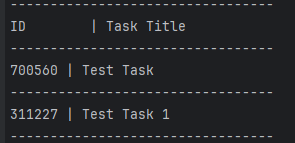

## Rust Todo CLI [Not Published]
Just a simple todo application, very **basic**, uses File system manipulation 
to store the tasks in a ``JSON`` file for managing the storage.

## Some simple commands:
List all the tasks:
```rust!
cargo run todo
```

Create a new Task:
```rust!
cargo run todo --add "Title for the Task"
```

Remove a Task:
```rust!
cargo run todo --done "ID for the task"
```

The tasks created are stored in a `JSON` file named `todo.json`, example how
it's stored in the file.

```json
[
  {
    "id": 700560,
    "title": "Test Task"
  },
  {
    "id": 311227,
    "title": "Test Task 1"
  }
]
```

Result of the `cargo run todo` command: \
\


## Tests:

```text
1. test_read_all_tasks
2. test_mark_as_done
3. test_mark_as_done
4. test_add_new_task
```
Tests can be executed using the following command: `cargo test`

Nothing special going on, just practicing 👍

